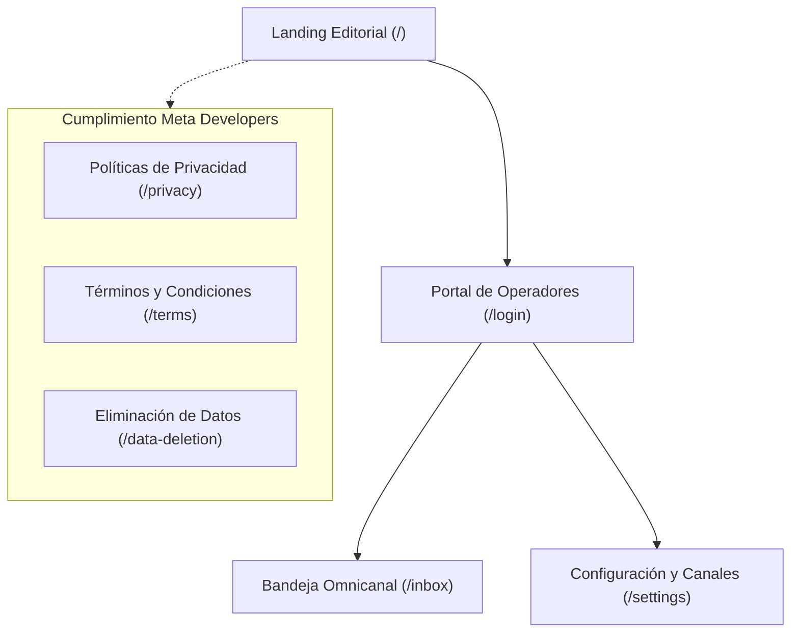

# Lecturas de Tarde - Frontend Web Application 📖✨

[](https://react.dev/)
[](https://vitejs.dev/)
[](https://reactrouter.com/)
[](https://socket.io/)
[](https://developer.mozilla.org/en-US/docs/Web/CSS)
[](https://developers.facebook.com/docs/development/release/compliance)

Aplicación web SPA (*Single Page Application*) desarrollada con **React 19** y **Vite**, diseñada con una cuidada estética editorial cálida (*Warm Editorial Dark*) y sistema de temas dinámico. Proporciona una interfaz de atención al cliente omnicanal para gestionar conversaciones entrantes de **WhatsApp**, **Facebook Messenger** e **Instagram Direct** en tiempo real.

---

## 📑 Tabla de Contenidos

- [Características Principales](#-características-principales)
- [Módulos de la Aplicación](#-módulos-de-la-aplicación)
- [Diseño y Sistema Visual](#-diseño-y-sistema-visual)
- [Stack Tecnológico](#-stack-tecnológico)
- [Estructura del Proyecto](#-estructura-del-proyecto)
- [Instalación y Puesta en Marcha](#-instalación-y-puesta-en-marcha)
- [Configuración del Proxy de Desarrollo](#-configuración-del-proxy-de-desarrollo)
- [Despliegue en Producción](#-despliegue-en-producción)
- [Cumplimiento con Directrices de Meta](#-cumplimiento-con-directrices-de-meta)

---

## 🌟 Características Principales

* **Bandeja de Entrada Omnicanal Unificada (`/inbox`):**
  * Vista centralizada de chats con filtrado rápido por canal (WhatsApp, Instagram, Messenger) y búsqueda instantánea.
  * Sincronización en vivo vía **Socket.io** sin necesidad de refrescar la página.
  * Contador de mensajes no leídos y estado de conexión en tiempo real.
* **Control de Ventana de Mensajería de Meta:**
  * Indicador visual dinámico de la ventana de 24 horas para cada conversación.
  * Alerta de tiempo restante y soporte para la etiqueta oficial `HUMAN_AGENT` (hasta 7 días de respuesta permitida).
* **Gestión Inteligente de Scroll y Mensajes:**
  * **Bloqueo Inteligente de Desplazamiento:** Si el operador está leyendo el historial de mensajes antiguos hacia arriba, la vista no salta abruptamente cuando llega un nuevo mensaje entrante.
  * **Botón Flotante de Desplazamiento:** Notificación `↓ Nuevos mensajes` con conteo, que permite bajar suavemente al último mensaje con un solo clic.
* **Soporte Multimedia Completo:**
  * Reproductor de audio integrado para notas de voz (`.ogg` / `.mp3`).
  * Galería de imágenes con modal de ampliación en alta resolución (*Lightbox*).
  * Renderizado transparente y estilizado para stickers de WhatsApp.
  * Visualización y descarga segura de documentos adjuntos (PDF, DOCX, etc.).
* **Escáner de Canales en 1 Clic (`/settings`):**
  * Detección automática de todas las Fan Pages de Facebook y cuentas comerciales de Instagram vinculadas mediante un User Token de Meta.
  * Conexión y suscripción a Webhooks con un solo clic sin necesidad de ingresar IDs manuales.
* **Handover Protocol (Bot vs Humano):**
  * Interruptor visual para pausar o activar el bot de bienvenida por conversación según la necesidad del operador.

---

## 🧭 Módulos de la Aplicación



### 1. Portal Público y Landing Page (`/`)
Presentación de la marca **Lecturas de Tarde**, catálogo de lecturas y recomendaciones literarias, acompañada de un botón de contacto directo y acceso al portal de administración.

### 2. Bandeja Omnicanal (`/inbox`)
Consola principal para operadores. Diseñada para alto volumen de interacciones, permitiendo responder rápidamente con textos, emojis o archivos adjuntos.

### 3. Panel de Configuración (`/settings`)
* **Gestión de Canales:** Visualización de canales activos y escáner de Meta Graph API v25.0.
* **Automatización del Bot:** Redacción de mensaje de bienvenida con interpolación dinámica (`{{cliente}}`, `{{canal}}`).
* **Operadores:** Alta y gestión de agentes autorizados.
* **Auditoría:** Registro de eventos y actividad de Webhooks.

### 4. Páginas Legales y Compliance
* `/privacy`: Declaración detallada de uso, protección y cifrado de datos conforme al RGPD y políticas de Meta.
* `/terms`: Condiciones de servicio para usuarios del chatbot y la plataforma.
* `/data-deletion`: Mecanismo transparente para solicitud y seguimiento de eliminación de datos de usuario.

---

## 🎨 Diseño y Sistema Visual

La aplicación implementa una estética de alta gama inspirada en el mundo editorial:

* **Paleta de Colores:** Tonos cálidos pergamino, acentos dorados ámbar (`#D4AF37`, `#F59E0B`) sobre fondos oscuros azul noche/grafito profundo (`#0B0F19`, `#111827`).
* **Modo Oscuro / Claro:** Alternador de tema (`ThemeToggle`) accesible en toda la interfaz con persistencia en `localStorage`.
* **Tipografía:**
  * Títulos: *Cinzel* (elegancia editorial clásica).
  * Textos y chats: *Outfit* (legibilidad moderna y limpia en pantallas de cualquier tamaño).
* **Responsive Design:** Adaptado para pantallas de escritorio, tablets y dispositivos móviles.

---

## 🛠 Stack Tecnológico

| Componente | Tecnología | Versión |
| :--- | :--- | :--- |
| **Librería UI** | React | 19.2 |
| **Herramienta de Construcción** | Vite | 8.2 |
| **Enrutamiento SPA** | React Router DOM | 7.1 |
| **Cliente WebSockets** | Socket.io Client | 4.8 |
| **Estilos** | Vanilla CSS3 | Modern Custom Properties & Flex/Grid |
| **Tipografía** | Google Fonts | Cinzel & Outfit |

---

## 📁 Estructura del Proyecto

```text
frontend/
├── index.html               # Plantilla HTML principal con carga de tipografías
├── package.json             # Dependencias y scripts de Vite
├── vite.config.js           # Configuración de Vite y proxy de desarrollo
├── .gitignore               # Exclusión de node_modules, dist y .env
├── public/                  # Archivos estáticos y favicons
└── src/
    ├── main.jsx             # Punto de entrada de la aplicación React
    ├── App.jsx              # Configuración de rutas y proveedores de contexto
    ├── style.css            # Variables globales, reset y estilos de landing
    ├── inbox.css            # Estilos especializados de la bandeja de entrada
    ├── settings.css         # Estilos del panel de configuración
    ├── components/          # Componentes reutilizables
    │   ├── BrandMark.jsx    # Logotipo e isotipo de la marca
    │   ├── Navbar.jsx       # Barra de navegación principal
    │   ├── ProtectedRoute.jsx # Guardián de rutas autenticadas
    │   ├── PublicLayout.jsx # Layout para vistas públicas
    │   ├── ThemeToggle.jsx  # Selector de modo claro/oscuro
    │   └── inbox/           # Componentes de la consola de chat
    │       ├── ChatArea.jsx
    │       ├── ChatList.jsx
    │       └── EmptyState.jsx
    ├── context/             # Estados globales de la aplicación
    │   ├── AuthContext.jsx  # Gestión de sesión del operador
    │   └── ThemeContext.jsx # Gestión del tema visual
    └── pages/               # Vistas principales
        ├── DataDeletionPage.jsx
        ├── InboxPage.jsx
        ├── LandingPage.jsx
        ├── LoginPage.jsx
        ├── PrivacyPage.jsx
        ├── SettingsPage.jsx
        └── TermsPage.jsx
```

---

## 🚀 Instalación y Puesta en Marcha

### 1. Clonar el repositorio
```bash
git clone <URL_DEL_REPOSITORIO_FRONTEND>
cd <CARPETA_DEL_REPOSITORIO>
```

### 2. Instalar dependencias
```bash
npm install
```

### 3. Iniciar el servidor de desarrollo
```bash
npm run dev
```
La aplicación estará disponible de forma predeterminada en: `http://127.0.0.1:5173`.

---

## 🔄 Configuración del Proxy de Desarrollo

Para evitar problemas de CORS durante el desarrollo local, el archivo `vite.config.js` incluye una regla de proxy que reenvía automáticamente las peticiones hacia el backend:

```javascript
// vite.config.js
export default defineConfig({
  plugins: [react()],
  server: {
    proxy: {
      '/api': 'http://localhost:3000',
      '/health': 'http://localhost:3000',
      '/uploads': 'http://localhost:3000',
      '/socket.io': {
        target: 'http://localhost:3000',
        ws: true,
      },
    },
  },
});
```

---

## 📦 Despliegue en Producción

### Generar la compilación optimizada:
```bash
npm run build
```
Esto creará la carpeta `dist/` con los archivos minificados y optimizados listos para servir.

### Opciones de Despliegue:
* **Vercel / Netlify / Cloudflare Pages:** Simplemente conecta el repositorio y configura el comando de build en `npm run build` y el directorio de salida en `dist`.
* **Servidor Nginx / Apache:** Configura el servidor web para servir la carpeta `dist/` redirigiendo todas las rutas a `index.html` (para el correcto funcionamiento del enrutamiento del lado del cliente).

---

## 🔒 Cumplimiento con Directrices de Meta

Este frontend ha sido estructurado específicamente para cumplir con todos los requisitos del proceso de **Meta App Review**:
1. **Páginas Legales Públicas:** Enlaces claros a Términos y Privacidad en el pie de página.
2. **Eliminación de Datos Transparente:** La vista `/data-deletion` ofrece a los usuarios un formulario para rastrear solicitudes de borrado según las exigencias de Facebook Login.
3. **Manejo Seguro de Sesiones:** El cliente utiliza cookies HTTP seguras y nunca manipula contraseñas ni tokens de Meta en texto plano.

---

## 📄 Licencia y Autoría

Desarrollado para el sistema omnicanal de **Lecturas de Tarde** ([lecturasdetarde.online](https://lecturasdetarde.online)). Todos los derechos reservados.
